# SpaceInvaders

## Sommaire
- [Semaine n°1 : du 30 au 05 avril](#semaine1)  
- [Semaine n°2 : du 06 au 12 avril](#semaine2)  
- [Semaine n°3 : du 13 au 19 avril](#semaine3)  
- [Semaine n°4 : du 04 au 10 mai](#semaine4)
- [Semaine n°5 : du 11 au 17 mai](#semaine5)
- [Semaine n°6 : du 18 au 24 mai](#semaine6)
- [Glossaire](#glossaire)

## Semaine n°1 : du 30 au 05 avril 

### Sprints et fonctionnalités réalisées 

#### Fonctionnalité n°1 : Déplacer un vaisseau dans l'espace de jeu (fini)

- Story n°1 : Créer un espace de jeu  
Un espace de jeu est créé aux dimensions données (2D) 
Cet espace de jeu est vide

-  Story n°2 : Positionner un nouveau vaisseau dans l’espace de jeu  
Un nouveau vaisseau est créé
Le vaisseau est positionné aux coordonnées transmises
Si un nouveau vaisseau essaye d’être positionné en dehors des limites de l’espace jeu, alors une exception devra être levée.
 Contraintes :
La position souhaitée est transmise par ses coordonnées x et y.
Le coin supérieur gauche de l’espace jeu (point en haut à gauche) a pour coordonnées (0,0)
La taille du vaisseau est réduite pour l'instant à son minimum (1 seul point)    

- Story n°3 : Déplacer le vaisseau vers la droite dans l'espace de jeu  
Le vaisseau se déplace d'un pas vers la droite 
Si le vaisseau se trouve sur la bordure droite de l'espace de jeu, le vaisseau doit rester immobile (aucun déplacement, aucune exception levée : le vaisseau reste juste à sa position actuelle).

- Story n°4 : Déplacer le vaisseau vers la gauche dans l'espace de jeu  
Le vaisseau se déplace d'un pas vers la gauche 
Si le vaisseau se trouve sur la bordure gauche de l'espace de jeu, le vaisseau doit rester immobile (aucun déplacement, aucune exception levée : le vaisseau reste juste à sa position actuelle).

### Fonctionnalité en cours d’implémentation : 
Aucune

### Diagramme de classes 

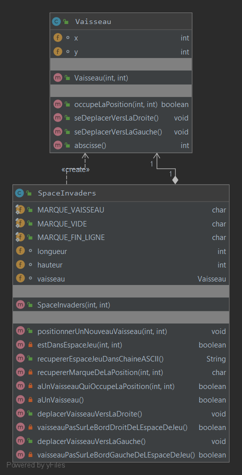

### Nuage de mots du projet spaceinvaders (séance n°1)  
(généré à l’aide de Source Code Word Cloud Generator avec la liste JavaBlacklist.txt fournie en annexe)
 
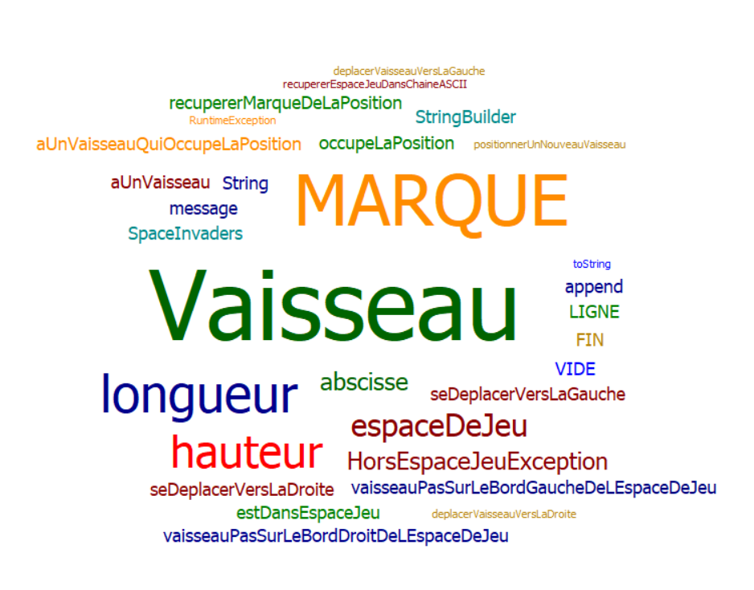

### Difficultés rencontrées 
Aucune

### Remarques diverses
 Pour pouvoir, mettre en place les tests, il a été nécessaire d’ajouter une fonctionnalité supplémentaire qui permet de représenter l’espace de jeu dans une chaîne ASCII.

-------------

## Semaine n°2 : du 06 au 12 avril 

### Sprints et fonctionnalités réalisées
 
#### Fonctionnalité n°2 : Dimensionner le vaisseau (fini)  

- Story n°1 :  Positionner un nouveau vaisseau avec une dimension donnée   
Un nouveau vaisseau avec une dimension donnée est créé à une position donnée.

-  Story n°2 : Faire en sorte qu'il soit impossible de positionner un nouveau vaisseau qui déborde de l'espace de jeu  
Un nouveau vaisseau est créé  
Si un nouveau vaisseau essaye d’être positionné en dehors des limites de l’espace jeu, alors une exception devra être levée.  
 Contraintes :  
La position souhaitée est transmise par ses coordonnées x et y.  
Le coin supérieur gauche de l’espace jeu (point en haut à gauche) a pour coordonnées (0,0)  
La taille du vaisseau est déterminée par une hauteur et une longueur   

- Story n°3 : Déplacer un vaisseau vers la droite en tenant compte de sa dimension  
Le vaisseau se déplace d'un pas vers la droite   
Si le vaisseau se trouve sur la bordure droite de l'espace de jeu, le vaisseau doit rester immobile (aucun déplacement, aucune exception levée : le vaisseau reste juste à sa position actuelle).  

- Story n°4 : Déplacer un vaisseau vers la gauche en tenant compte de sa dimension   
Le vaisseau se déplace d'un pas vers la gauche   
Si le vaisseau se trouve sur la bordure gauche de l'espace de jeu, le vaisseau doit rester immobile (aucun déplacement, aucune exception levée : le vaisseau reste juste à sa position actuelle).  

### Fonctionnalité en cours d’implémentation : 

Aucune

### Diagramme de classes

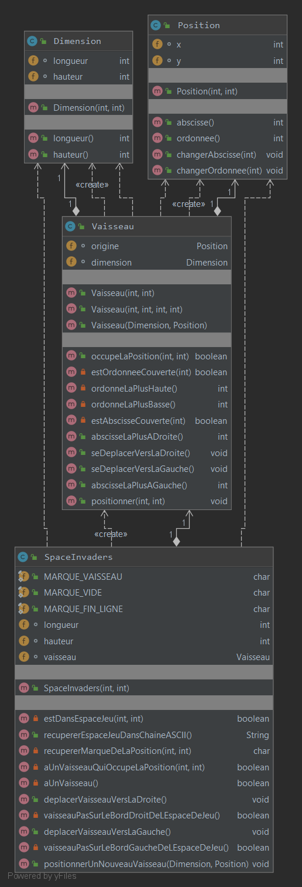

### Nuage de mots du projet spaceinvaders (séance n°2) 

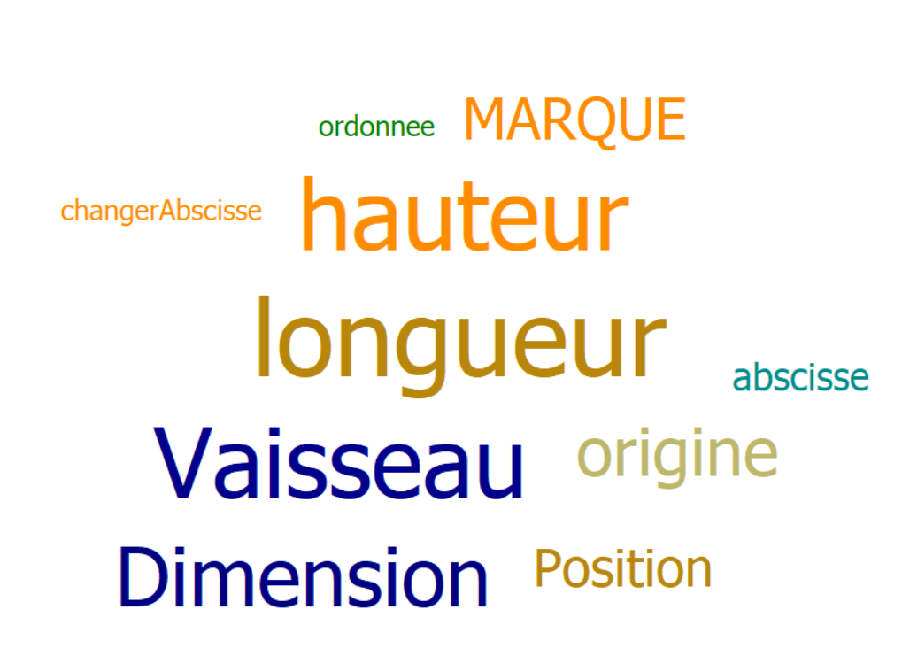

### Difficultés rencontrées   

Aucune.  

### Remarques diverses

Aucune

-------------
## Semaine n°3 : du 13 au 19 avril 

### Sprints et fonctionnalités réalisées 
#### Fonctionnalité n°3 : Choisir la vitesse du vaisseau (fini)  

- Story n°1 :  Faire en sorte que le déplacement se fasse correctement pour une vitesse quelconque.   
Le vaisseau se déplace d'un pas vers la droite ou vers la gauche à une vitesse choisi au préalable    

- Story n°2 : Intégration d'un moteur graphique  
Lors du lancement du jeu une fenêtre d'une dimension choisie s'ouvre contenant un vaisseau placé à une certaine position choisie au préalable.  
Le vaisseau peut se déplacer à gauche et à droite dans la fenêtre.

### Fonctionnalité en cours d’implémentation : 

Aucune    

### Diagramme de classes

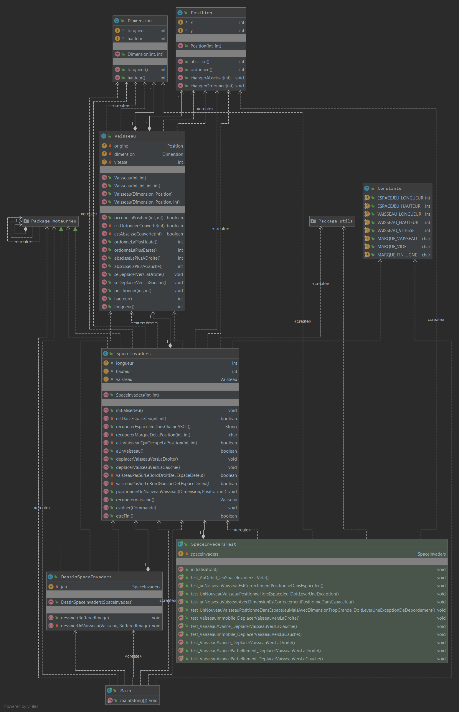

### Nuage de mots du projet spaceinvaders (séance n°3) 

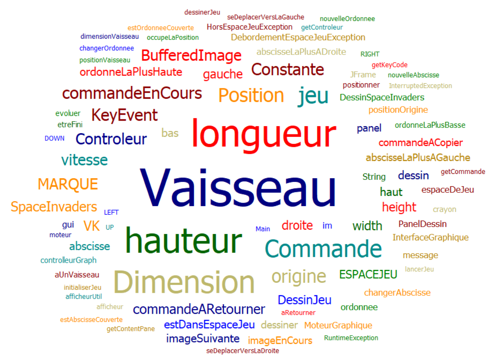

### Difficultés rencontrées   

Aucune.  

### Remarques diverses

Aucune

-------------

## Semaine n°4 : du 04 au 10 mai 

### Sprints et fonctionnalités réalisées 

#### Fonctionnalité n°4 : Tirer un missile (fini)  

- Story n°1 : Tirer un Missile  
Quand l'utilisateur appuie sur la barre espace un missile est créé et dessiné sur l'interface.  
Contraintes : il n'y a pas déjà un missile dans l'espace de jeu.  

- Story n°2 : Déplacement automatique Missile  
Quand l'utilisateur appuie sur la barre espace un missile est créé et dessiné sur l'interface.  
Il se déplace automatiquement vers le haut de l'écran.  
Le missile disparait quand une partie du missile sort de l'espace de jeu.  

### Fonctionnalité en cours d’implémentation : 

Fonctionnalité n°5  : création de l'envahisseur à l'initialisation du jeu.   

### Diagramme de classes

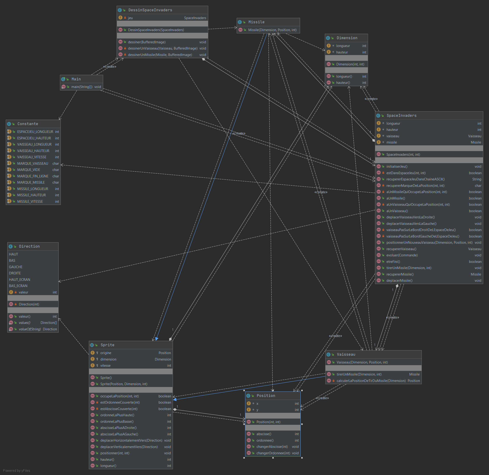

### Nuage de mots du projet spaceinvaders (séance n°4) 

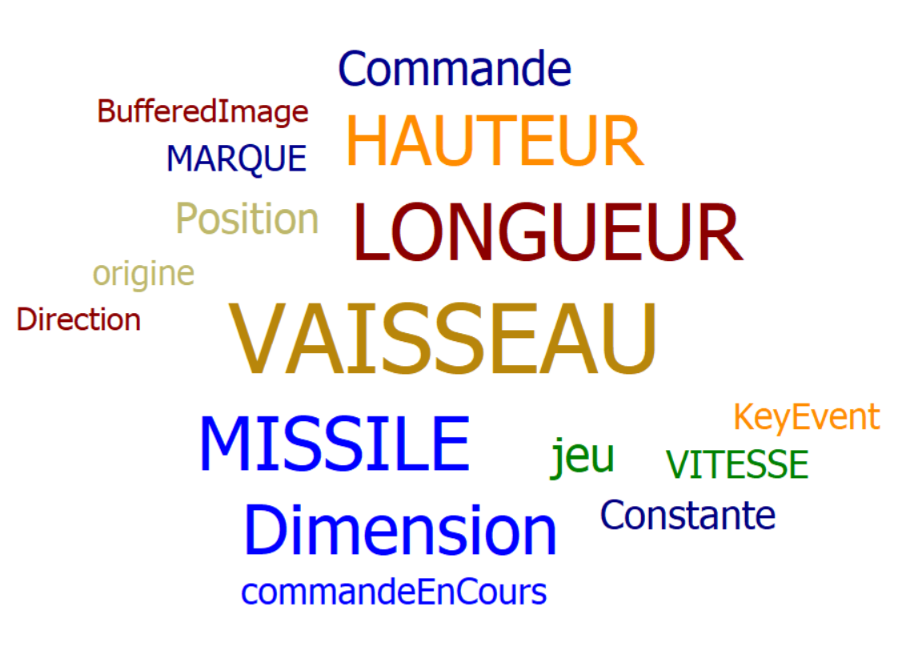

### Difficultés rencontrées   

Aucune.  

### Remarques diverses

Aucune

-------------

## Semaine n°5 : du 11 au 17 mai 

### Sprints et fonctionnalités réalisées 

#### Fonctionnalité n°5 : Ajouter un envahisseur (fini)  

- Story n°1 : Création d'un envahisseur 
A l'initialisation du jeu un envahisseur est crée et placé dans l'espace de jeu 

- Story n°2 : Déplacement automatique envahisseur 
L'envahisseur se déplace de gauche à droite jusqu'à atteindre le bord droit de l'espace de jeu.  
L'envahisseur se déplace ensuite de droite à gauche jusqu'à atteindre le bord gauche de l'espace de jeu.  
Ces actions sont répétées jusqu'à la fin du jeu.  

### Fonctionnalité en cours d’implémentation : 

  

### Diagramme de classes

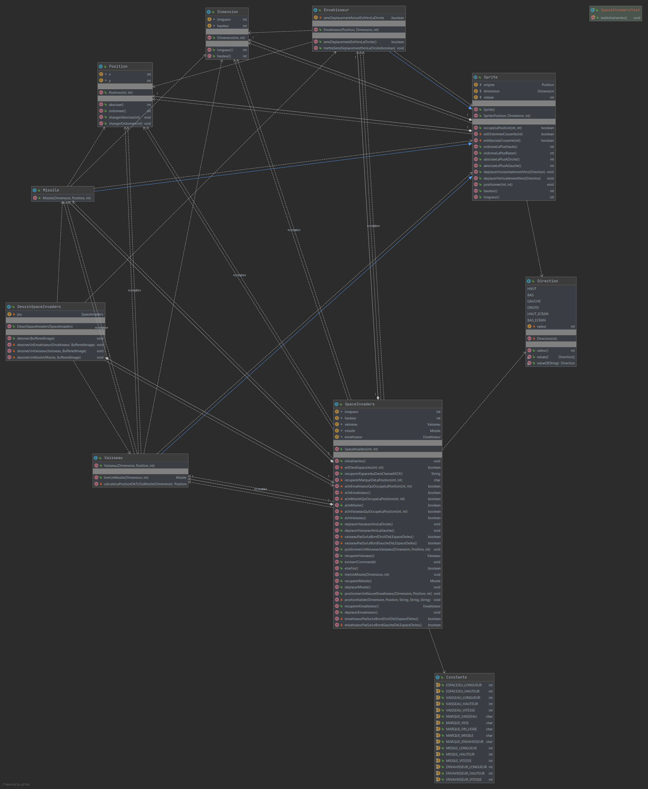

### Nuage de mots du projet spaceinvaders (séance n°5) 

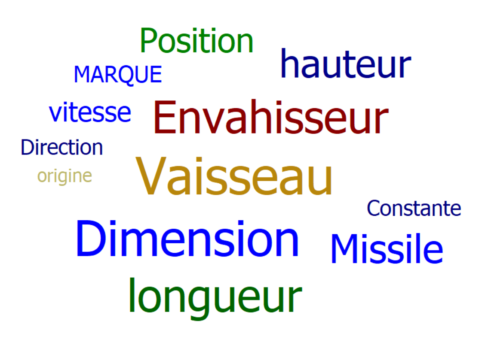

### Difficultés rencontrées   

Aucune.  

### Remarques diverses

Aucune.

-------------

## Semaine n°6 : du 18 au 24 mai 

### Sprints et fonctionnalités réalisées  

#### Fonctionnalité n°6 : Détecter une collision  

-Story n°1 : Collision entre deux sprites  
Quand un sprite entre en collision avec un autre (intersection des deux rectangles) la méthode retourne true.  

### Diagramme de classes

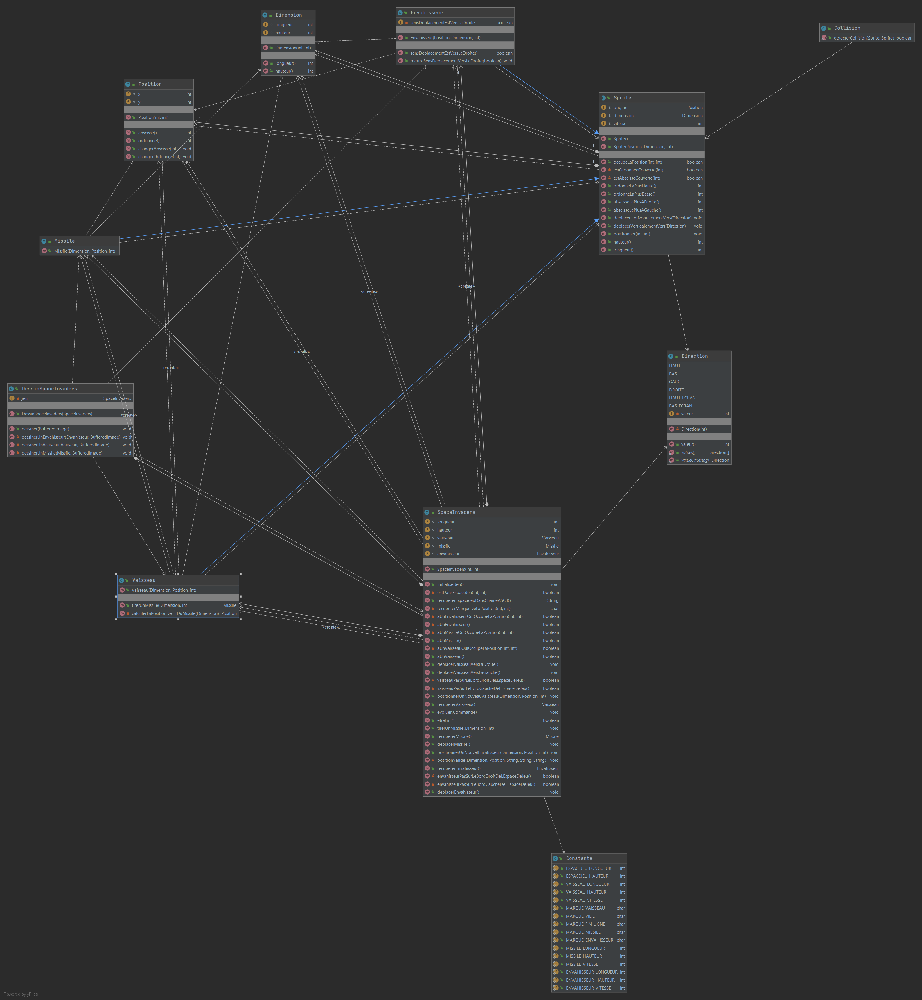

### Nuage de mots du projet spaceinvaders (séance n°6) 

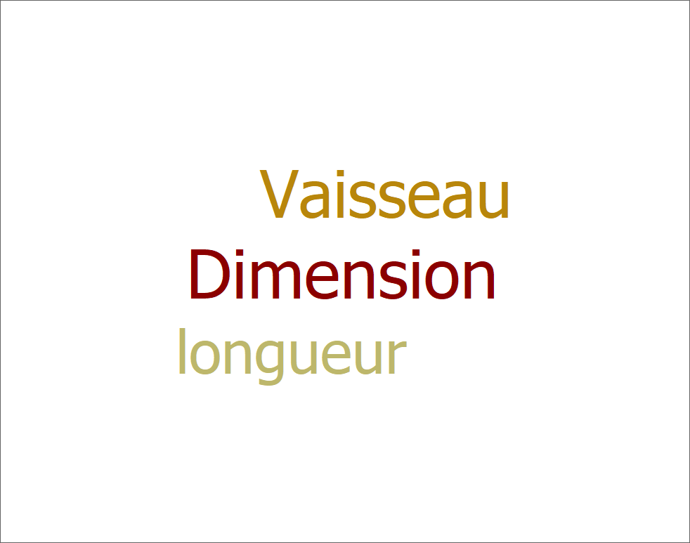

### Difficultés rencontrées   

Aucune.

### Remarques diverses

Les tests doivent ils être différents pour les collisions vaisseau-envahisseur et envahisseur-missile ?

-------------

## Glossaire 

* **Vaisseau** :  véhicule commandé par le joueur, pouvant se déplacer de droite à gauche et ayant la possibilité de lancer des missiles destinés à détruire le(s) envahisseurs.

* **Envahisseur**  :  ennemi qui apparaît à l'écran, se déplace automatiquement et qui doit être détruit par un missile lancé depuis le vaisseau du joueur.

* **Missile** :  projectile envoyé à la verticale par le vaisseau vers l'envahisseur dans le but de le détruire.

* **Sprite** : élément graphique qui peut se déplacer sur l'écran.  
